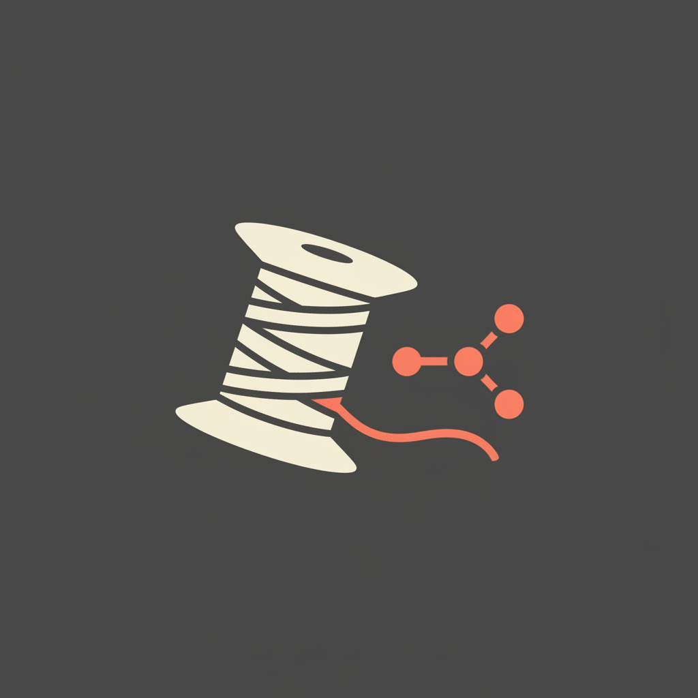

<p align="center">
  
</p>

# comfyui-weaver 🧵

[](LICENSE)
[](https://www.python.org/)
[](https://modelcontextprotocol.io/)
[](#install-windows-powershell)
[](#the-non-disruption-contract)

**Weaves Claude Code into your ComfyUI — local and Comfy Cloud — running
your renders quietly in the background without ever tangling your threads.**

A self-contained MCP server that lets Claude Code operate a ComfyUI
installation: discover nodes and models, build/convert/run workflows, track
jobs, look at the results (Claude reads the images it generates), run
parameterized templates on Comfy Cloud, and orchestrate a full
script→storyboard→video film pipeline on top.

```
Claude Code ──(stdio MCP)── comfy_mcp_server.py ──┬─(HTTP/WS)── local ComfyUI
                                                  └─(HTTPS)──── cloud.comfy.org
```

## The non-disruption contract

Built for setups where ComfyUI is a *working tool*, not a toy. The server:

- never starts, stops, or restarts ComfyUI — it attaches to what's running;
- always queues at the **back** (never `front`), never clears queue/history;
- namespaces everything it generates under `output/claude/` and
  `input/claude/` — refuses workflows whose save paths it can't contain;
- only cancels jobs it submitted itself (unless you `force`);
- never frees VRAM or unloads models behind your back;
- submits **cloud** jobs (your credits!) only on explicit request.

## Install (Windows, PowerShell)

1. Clone — inside your ComfyUI data directory is simplest:
   ```powershell
   cd <your ComfyUI data dir>     # the folder holding models/, output/, user/
   git clone https://github.com/GuusF/comfyui-weaver claude-integration
   powershell -ExecutionPolicy Bypass -File claude-integration\install.ps1
   ```
   The installer creates a private venv (your ComfyUI's Python is never
   touched), installs deps (`mcp`, `httpx`, `websockets`, `pillow`), writes a
   `.mcp.json` for Claude Code, and runs an offline self-test.

2. Cloned somewhere else instead? Set the data dir explicitly in `.mcp.json`:
   ```json
   "env": { "COMFY_DATA_DIR": "D:\\path\\to\\ComfyUI" }
   ```

3. Restart Claude Code in that folder and approve the `comfyui` server.
   Say *"check comfy status"* to verify.

Ports: auto-detects `127.0.0.1:8000` (Desktop) then `:8188` (standalone);
override with `COMFYUI_URL`.

### Comfy Cloud (optional)

Create an API key at platform.comfy.org (paid tier required for API access;
the full key is shown only once) and save it as the single line of
`state/cloud_api_key.txt` (git-ignored, picked up without restart) — or set
`COMFY_CLOUD_API_KEY`. Every cloud run consumes your credits; the bridge
makes Claude state costs before submitting.

## What Claude can do with it

22+ tools, the highlights:

| | |
|---|---|
| `comfy_status`, `search_nodes`, `node_info`, `list_models` | discover what's installed |
| `run_workflow` (API or UI-format JSON, or a named template) | execute, with validation + output containment |
| `wait_for_job`, `job_status`, `cancel_job`, `queue_info` | job lifecycle, queue-aware |
| `view_output` | Claude *sees* the result inline and can QC it |
| `history_to_template` | turn any past run into a reusable parameterized template — the fastest path to a working pipeline |
| `convert_ui_to_api` | editor JSON → API JSON (handles dict-form widgets_values, reroutes, primitives) |
| `get_logs` | server log tail for debugging failed runs |
| `cloud_*` (status, models, run, wait, upload, cancel) | the same flows on Comfy Cloud GPUs |

Templates ship in `templates/` (text-to-image, image-to-video via Kling
partner nodes, tiled Flux 2 upscaling with LoRA slots) and are plain JSON —
add your own or let Claude capture them from history.

## The film pipeline (optional, fun)

`film/` + `docs/skills/film-production/` implement a gate-based short-film
pipeline: script → shot manifest (single source of truth) → look dev →
storyboard keyframes → animatic ("lock pacing before money") → per-shot
video takes (local or cloud) → vision-QC dailies (Claude reads frames and
flags retakes) → assembly + CMX3600 EDL for your NLE. See
`film/PIPELINE.md`.

## Claude Code knowledge files

`docs/skills/` contains skill files that teach Claude the workflow JSON
format, tool recipes, and pipeline etiquette. Copy them into your project:

```powershell
Copy-Item -Recurse docs\skills\* <data dir>\.claude\skills\
```

`docs/CLAUDE.example.md` is a starting point for the data dir's `CLAUDE.md`
(the rules Claude follows there) — edit it to match your machine.

## Verify

```powershell
.venv\Scripts\python.exe tests\smoke_test.py            # full (needs ComfyUI running)
.venv\Scripts\python.exe tests\smoke_test.py --offline  # protocol + imports only
.venv\Scripts\python.exe tests\cloud_test.py            # cloud auth + catalog (free)
```

The live test queues a LoadImage→SaveImage passthrough — no GPU, no models,
and verifies output lands in `output/claude/` with your queue untouched.

## Security notes

- `state/` (API key, job tracking, logs) is git-ignored — keep it that way.
- The API key file is plain text on your disk; rotate it at platform.comfy.org
  if it ever leaks. Never commit it.
- The MCP server binds nothing: it's stdio-only, spawned by Claude Code.

## License

MIT — see [LICENSE](LICENSE).
